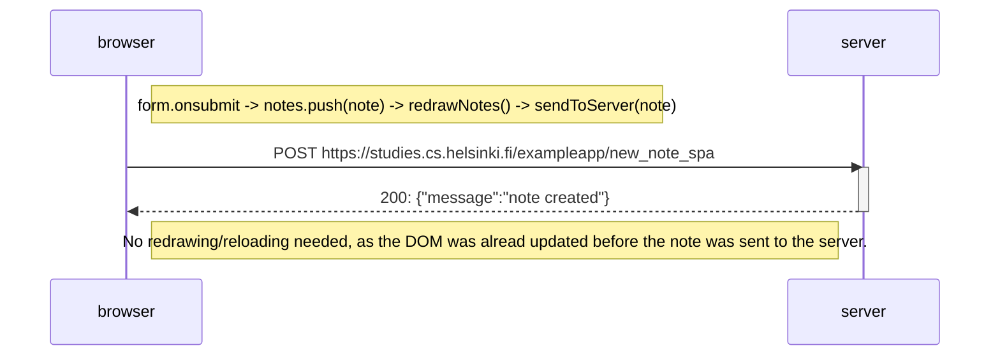

```mermaid
sequenceDiagram
    participant browser
    participant server

    Note right of browser: form.onsubmit -> notes.push(note) -> redrawNotes() -> sendToServer(note)

    browser->>server: POST https://studies.cs.helsinki.fi/exampleapp/new_note_spa
    activate server
    server-->>browser: 200: {"message":"note created"}
    deactivate server

    Note right of browser: No redrawing/reloading needed, as the DOM was alread updated before the note was sent to the server.
```